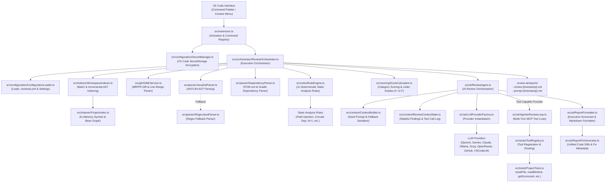
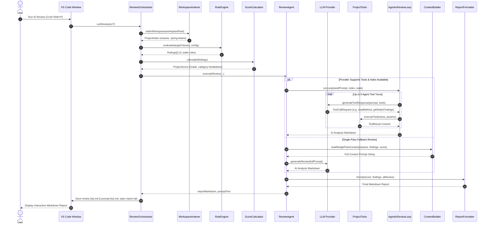

# AI Java Reviewer — Comprehensive System Knowledge Graph & Architectural Blueprint

This document serves as the persistent Knowledge Graph for the **AI Java Reviewer** project (`v1.3.25`). It maps all components, data flow pipelines, static analysis rules, LLM orchestration loops, on-demand MCP tools, and configuration schemas.

---

## 1. High-Level Component Knowledge Graph



---

## 2. Component & Module Directory Map

| Module | Core Files | Primary Responsibilities | Key Symbol References |
|---|---|---|---|
| **Entry Point & Commands** | [src/extension.ts](file:///Users/asiff/Documents/projects/codeReview/src/extension.ts)<br>[src/commands/RunMrReviewCommand.ts](file:///Users/asiff/Documents/projects/codeReview/src/commands/RunMrReviewCommand.ts) | Extension lifecycle, logging initialization, command binding | `activate()`, `RunReviewCommand`, `RunMrReviewCommand` |
| **Git & MR Service** | [src/git/GitMrService.ts](file:///Users/asiff/Documents/projects/codeReview/src/git/GitMrService.ts) | Parses GitLab MR & GitHub PR diffs, line ranges (`5-10`), remote patches | `GitMrService`, `resolveMrDetails`, `parseUnifiedDiff` |
| **Orchestration** | [src/orchestrator/ReviewOrchestrator.ts](file:///Users/asiff/Documents/projects/codeReview/src/orchestrator/ReviewOrchestrator.ts) | Orchestrates workspace reviews (`runReview`) & MR diff reviews (`runMrReview`) | `ReviewOrchestrator.runReview()`, `runMrReview()` |
| **Workspace Indexer** | [src/indexer/WorkspaceIndexer.ts](file:///Users/asiff/Documents/projects/codeReview/src/indexer/WorkspaceIndexer.ts)<br>[src/indexer/ProjectIndex.ts](file:///Users/asiff/Documents/projects/codeReview/src/indexer/ProjectIndex.ts) | Scans workspace, indexes classes, Spring beans, interface implementations, handles file watcher events | `WorkspaceIndexer`, `ProjectIndex` |
| **Java Parsers** | [src/parser/JavaAstParser.ts](file:///Users/asiff/Documents/projects/codeReview/src/parser/JavaAstParser.ts)<br>[src/parser/RegexJavaParser.ts](file:///Users/asiff/Documents/projects/codeReview/src/parser/RegexJavaParser.ts)<br>[src/parser/DependencyParser.ts](file:///Users/asiff/Documents/projects/codeReview/src/parser/DependencyParser.ts) | Extracts AST nodes (imports, class annotations, fields, methods) and build file dependencies | `JavaAstParser`, `DependencyParser` |
| **Rule Engine & Static Rules** | [src/rules/RuleEngine.ts](file:///Users/asiff/Documents/projects/codeReview/src/rules/RuleEngine.ts)<br>`src/rules/*.ts` | Evaluates 11 deterministic static rules against target classes | `RuleEngine.evaluate()`, `IRule` |
| **Quality Scoring** | [src/scoring/ScoreCalculator.ts](file:///Users/asiff/Documents/projects/codeReview/src/scoring/ScoreCalculator.ts) | Calculates letter grade (A+ through F) and category scores (Architecture, Security, Testing, Maintainability) | `ScoreCalculator.calculate()` |
| **Context & State** | [src/context/ContextBuilder.ts](file:///Users/asiff/Documents/projects/codeReview/src/context/ContextBuilder.ts)<br>[src/context/ReviewContextState.ts](file:///Users/asiff/Documents/projects/codeReview/src/context/ReviewContextState.ts) | Generates minimal agent seed prompt (~150-300 tokens) or single-pass fallback context | `ContextBuilder`, `ReviewContextState` |
| **On-Demand MCP Tools** | [src/tools/ToolRegistry.ts](file:///Users/asiff/Documents/projects/codeReview/src/tools/ToolRegistry.ts)<br>[src/tools/ProjectTools.ts](file:///Users/asiff/Documents/projects/codeReview/src/tools/ProjectTools.ts) | Provides tools (`readFile`, `readMethod`, `getStaticFindings`, `getScorecard`, etc.) to LLM during agent loop | `ToolRegistry`, `ProjectTools` |
| **AI Providers & Agent Loop** | [src/ai/ReviewAgent.ts](file:///Users/asiff/Documents/projects/codeReview/src/ai/ReviewAgent.ts)<br>[src/ai/AgenticReviewLoop.ts](file:///Users/asiff/Documents/projects/codeReview/src/ai/AgenticReviewLoop.ts)<br>[src/ai/LLMProviderFactory.ts](file:///Users/asiff/Documents/projects/codeReview/src/ai/LLMProviderFactory.ts) | Provider instantiation, multi-turn tool loops, fallback reviews, and markdown formatting | `ReviewAgent`, `AgenticReviewLoop`, `LLMProviderFactory` |

---

## 3. End-to-End Execution Sequence Flow



---

## 4. Deterministic Static Rules Inventory

| Rule Name | Class File | Rule ID | Target Anti-Pattern | Severity |
|---|---|---|---|---|
| **Field Injection** | [FieldInjectionRule.ts](file:///Users/asiff/Documents/projects/codeReview/src/rules/FieldInjectionRule.ts) | `RULE_FIELD_INJECTION` | `@Autowired` placed directly on fields instead of constructors | `CRITICAL` |
| **Missing Transactional** | [MissingTransactionalRule.ts](file:///Users/asiff/Documents/projects/codeReview/src/rules/MissingTransactionalRule.ts) | `RULE_MISSING_TRANSACTIONAL` | Data modification methods (save, delete, update) missing `@Transactional` | `MAJOR` |
| **Repository In Controller** | [RepositoryInControllerRule.ts](file:///Users/asiff/Documents/projects/codeReview/src/rules/RepositoryInControllerRule.ts) | `RULE_REPO_IN_CONTROLLER` | Controllers accessing repository directly bypassing service layer | `CRITICAL` |
| **System Out Println** | [SystemOutPrintlnRule.ts](file:///Users/asiff/Documents/projects/codeReview/src/rules/SystemOutPrintlnRule.ts) | `RULE_SYS_OUT_PRINTLN` | Console logging (`System.out.println` or `e.printStackTrace()`) | `MINOR` |
| **Hardcoded Secret** | [HardcodedSecretRule.ts](file:///Users/asiff/Documents/projects/codeReview/src/rules/HardcodedSecretRule.ts) | `RULE_HARDCODED_SECRET` | Credentials, passwords, or secret key tokens hardcoded in source files | `BLOCKER` |
| **N+1 Query** | [NPlusOneQueryRule.ts](file:///Users/asiff/Documents/projects/codeReview/src/rules/NPlusOneQueryRule.ts) | `RULE_N_PLUS_ONE` | Repository or database calls executed inside loops | `CRITICAL` |
| **Missing Validation** | [MissingValidationRule.ts](file:///Users/asiff/Documents/projects/codeReview/src/rules/MissingValidationRule.ts) | `RULE_MISSING_VALIDATION` | `@RequestBody` controller parameters missing `@Valid` annotation | `MAJOR` |
| **FindAll Without Pagination** | [FindAllWithoutPaginationRule.ts](file:///Users/asiff/Documents/projects/codeReview/src/rules/FindAllWithoutPaginationRule.ts) | `RULE_FINDALL_PAGINATION` | `findAll()` calls missing `Pageable` or limit bounds | `MAJOR` |
| **Circular Dependency** | [CircularDependencyRule.ts](file:///Users/asiff/Documents/projects/codeReview/src/rules/CircularDependencyRule.ts) | `RULE_CIRCULAR_DEPENDENCY` | Spring component circular field dependencies | `BLOCKER` |
| **Missing Logging** | [MissingLoggingRule.ts](file:///Users/asiff/Documents/projects/codeReview/src/rules/MissingLoggingRule.ts) | `RULE_MISSING_LOGGING` | Spring service/controller components missing logger field instance | `MINOR` |
| **Missing Exception Handler** | [MissingExceptionHandlerRule.ts](file:///Users/asiff/Documents/projects/codeReview/src/rules/MissingExceptionHandlerRule.ts) | `RULE_MISSING_EXCEPTION_HANDLER` | Controllers lacking exception handling or `@ControllerAdvice` | `MAJOR` |

---

## 5. Supported AI Providers Matrix

| Provider ID | Provider Class | Auth Mechanism | Tool Loop Supported |
|---|---|---|---|
| `vscode-lm` | [VSCodeLMProvider.ts](file:///Users/asiff/Documents/projects/codeReview/src/ai/providers/VSCodeLMProvider.ts) | Native VS Code Chat Window API (Antigravity, Copilot Chat) | Yes |
| `openai` | [OpenAIProvider.ts](file:///Users/asiff/Documents/projects/codeReview/src/ai/providers/OpenAIProvider.ts) | Key stored in OS Keychain via SecretStorage | Yes |
| `gemini` | [GeminiProvider.ts](file:///Users/asiff/Documents/projects/codeReview/src/ai/providers/GeminiProvider.ts) | Key stored in OS Keychain via SecretStorage | Yes |
| `claude` | [AnthropicProvider.ts](file:///Users/asiff/Documents/projects/codeReview/src/ai/providers/AnthropicProvider.ts) | Key stored in OS Keychain via SecretStorage | Yes |
| `groq` | [GroqProvider.ts](file:///Users/asiff/Documents/projects/codeReview/src/ai/providers/GroqProvider.ts) | Key stored in OS Keychain via SecretStorage | Yes |
| `ollama` | [OllamaProvider.ts](file:///Users/asiff/Documents/projects/codeReview/src/ai/providers/OllamaProvider.ts) | Local HTTP Server (`http://localhost:11434`), No API Key | Single-Pass Fallback |
| `openrouter` | [OpenRouterProvider.ts](file:///Users/asiff/Documents/projects/codeReview/src/ai/providers/OpenRouterProvider.ts) | Key stored in OS Keychain via SecretStorage | Yes |
| `github` | [GithubProvider.ts](file:///Users/asiff/Documents/projects/codeReview/src/ai/providers/GithubProvider.ts) | Key stored in OS Keychain via SecretStorage | Yes |

---

## 6. MCP On-Demand Tool Catalog

| Tool Name | Tool Class / Handler | Purpose |
|---|---|---|
| `readFile` | `ReadFileTool` | Reads raw source content of target file |
| `readMethod` | `ReadMethodTool` | Fetches body of specified method |
| `getClassSummary` | `GetClassSummaryTool` | Returns class metadata, imports, annotations, and methods |
| `getClassSource` | `GetClassSourceTool` | Returns complete source code for target class |
| `getMethod` | `GetMethodTool` | Fetches method implementation by method name |
| `findSpringBeans` | `FindSpringBeansTool` | Returns list of categorized Spring beans in project index |
| `getStaticFindings` | `GetStaticFindingsTool` | Returns static analysis findings from state |
| `getScorecard` | `GetScorecardTool` | Returns quality scorecard (grade, points, breakdown) |
| `getDependencies` | `GetDependenciesTool` | Returns list of parsed project dependencies |

---

## 7. Workspace Configuration Schema (`.reviewai.yml`)

```yaml
javaVersion: "21"
framework: "spring-boot"
# provider: "openai"
# model: "gpt-4o"
outputDir: ".review-ai/reports"
# ollamaBaseUrl: "http://localhost:11434"
# openRouterBaseUrl: "https://openrouter.ai/api/v1"

# AI Prompt Customization
systemPrompt: "You are a senior Java security architect."
taskPrompt: "Review code and output architectural recommendations."

# Custom Rules Configuration
rules:
  dependency_injection:
    - constructor injection only
    - no field injection
  security:
    - no hardcoded secrets or credentials

# Severity Customization
severity:
  BLOCKER:
    - hardcoded secret
  CRITICAL:
    - controller accessing repository
```
