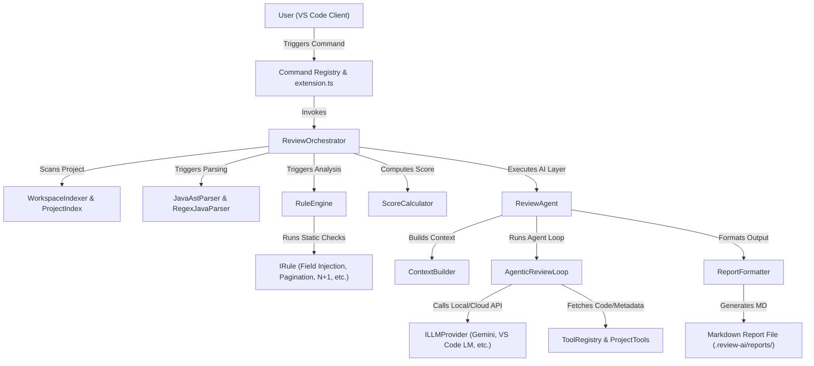
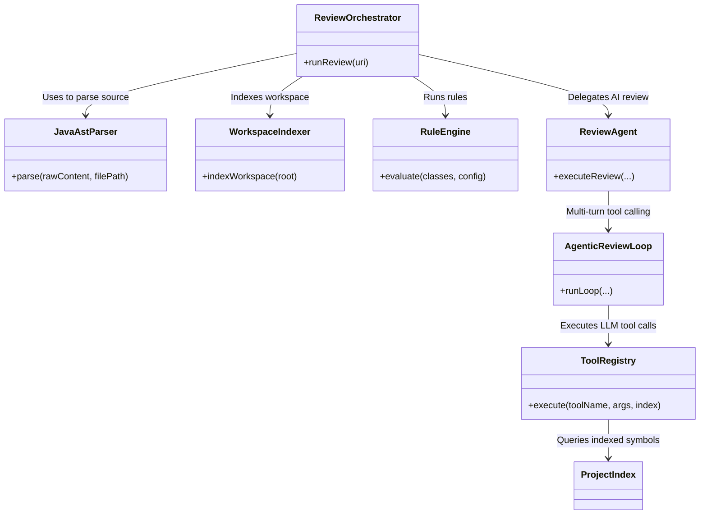

# AI Java Reviewer — System Architecture Analysis

This document provides a detailed architectural audit of the **AI Java Reviewer** VS Code Extension, mapping the relationships between VS Code commands, orchestrators, static analysis rules, AST parsers, and LLM integrations.

---

## 🏗️ Core Architecture Overview

The extension is designed as a hybrid static analysis and LLM-driven review system. The architecture is decomposed into the following layers:

---

## 🔌 Major Component Dependencies & Interaction Graph

---

## 🔍 Key Structural Findings

1. **Decoupled Configuration**: Setting keys are managed by a custom `ConfigurationLoader`, storing credentials securely via VS Code `SecretStorage`.
2. **Deterministic Rules & LLM Symbiosis**: Static findings from the rule engine are calculated first, generating a quality scorecard that is subsequently reviewed by the LLM.
3. **On-Demand (Pull) Design**: The initial context prompt (`seedPrompt`) is intentionally kept lightweight (~300 tokens) to fit within small LLM input context limits. It relies on the model executing MCP-style tool calling to retrieve file contents on demand.
