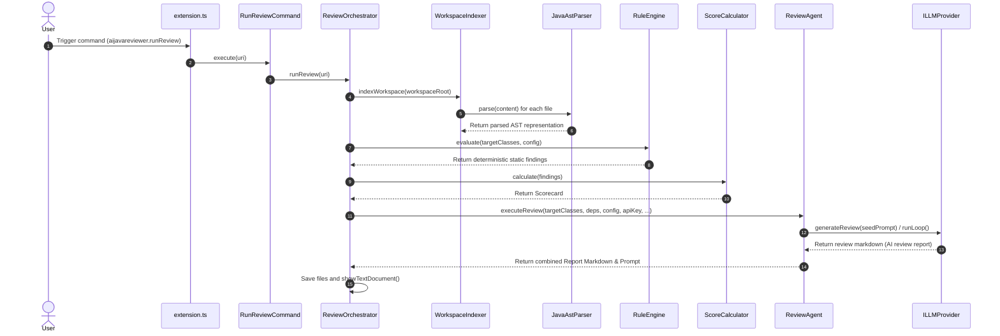

# AI Java Reviewer — Execution Flow & Sequence Analysis

This document describes the complete lifecycle of executing a review command.

## 🏃‍♂️ Tracing the Lifecycle: From Click to Report

The execution flow begins with either the command palette (`Run AI Review`) or right-clicking on a file/directory in the file explorer:

## 📋 Detail Method Registry

| Phase | Method | Class | Input | Output | Potential Failure Points |
| :--- | :--- | :--- | :--- | :--- | :--- |
| **Discovery** | `runReview(uri)` | `ReviewOrchestrator` | `vscode.Uri` (Optional) | `Promise<void>` | No workspace folders found; invalid URI paths; files not readable. |
| **Indexing** | `indexWorkspace(root)` | `WorkspaceIndexer` | `string` | `Promise<ProjectIndex>` | `findFiles` crashes or returns empty list. |
| **Parsing** | `parse(raw, path)` | `JavaAstParser` | `string, string` | `IJavaClass | undefined` | CST parsing throws exception due to syntax errors. Fallback to `RegexJavaParser`. |
| **Evaluation** | `evaluate(classes, config)` | `RuleEngine` | `IJavaClass[], IReviewConfig` | `IFinding[]` | Misconfigured overrides; rule crashes on empty method body. |
| **Execution** | `executeReview(...)` | `ReviewAgent` | `IJavaClass[], config, api...` | `Promise<IReviewResult>` | Agentic tool-calling loop hangs, or LLM provider errors out. |
